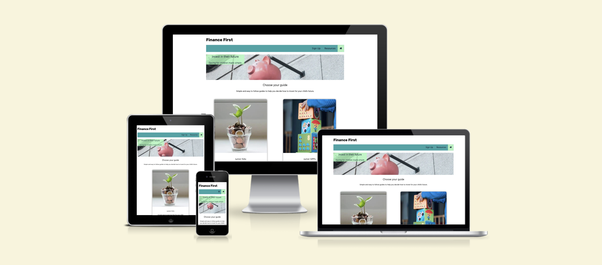
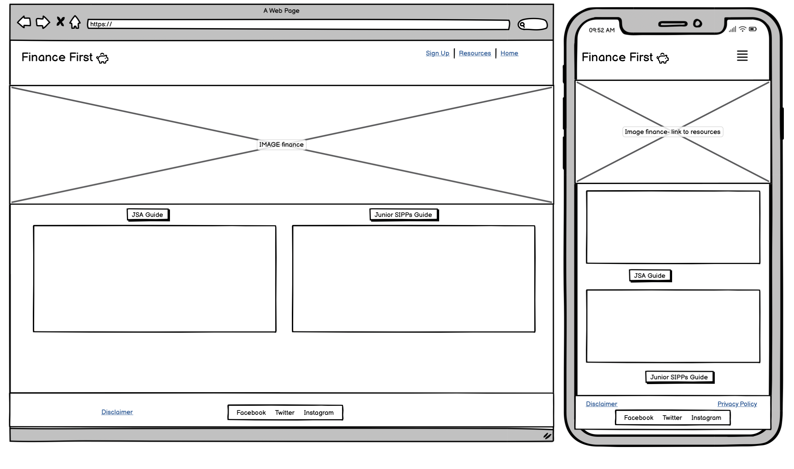
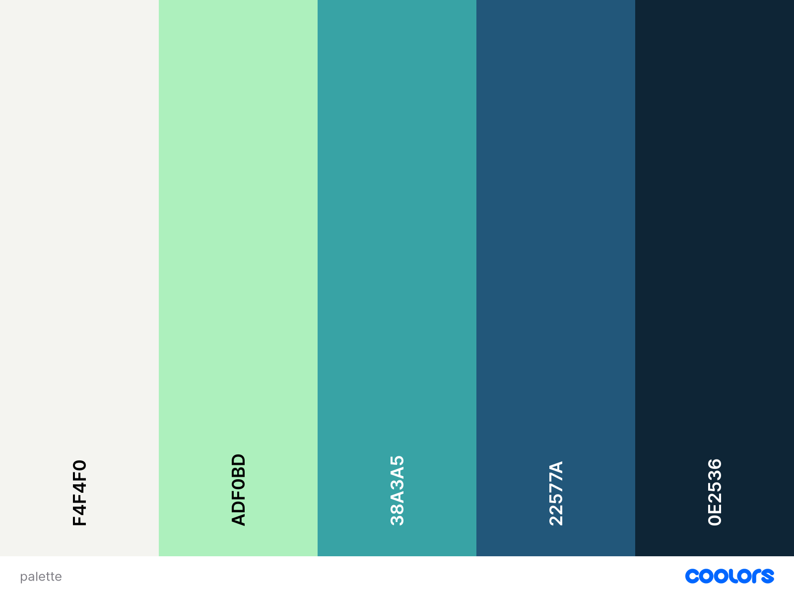
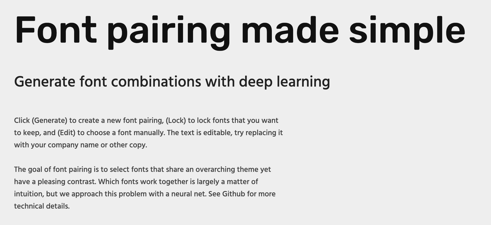

# Finance First

Visit the live site [here](https://katherine-holland.github.io/PP1-Finance-First/index.html)

Contents
1. [Introduction](#introduction)
2. [Design](#design)
3. [Features](#features)
4. [Future Features](#future)
5. [Manual Testing](#testing)
6. [Deployment](#deployment)
7. [Credits](#credits) 

## Introduction
**Audience:**
Finance First is the first stop for UK based parents and guardians looking to invest in their children's future. It provides an introduction to the financial products on offer in the UK aimed specifically at children aged between 0 - 18.
The site exists to raise awareness of the financial products on offer to parents and guardians looking to invest for their children and benefit from the tax breaks currently given. 
**Client side:**
The site is designed to encourage a targeted audience to sign up to an email list to generate an valuable database for marketing purposes.

## Design
The wireframe was created using Balsamiq. I created a basic landing page design which I then used as the basis for my project. https://balsamiq.com/

### Colours
I chose a cool colour palette to give a professional, trustworthy feel to the site. I used websites such as Hargreaves Lansdown https://www.hl.co.uk/ and Point 72 https://point72.com/ as my inspiration. The cool tones flow well together and the blues are calming. Green is also a colour associated with USD and contrasts well with blue. 

### Fonts
I used google fonts to choose two fonts that look good together and also fonts that would be professional and accessible in design. I chose Hind Madurai and Rubik.

## Features
Below are the core functions and elements I incorporated into the site.

### Navbar
I used Font Awesome to select my icons. I chose v4 to be compatible with the version I was coding with.
I decided to layout my navigation with the home page in the far right corner and with the sign up on the left. This was to encourage users to sign up to the newsletter and to increase the likelihood of growing an email list quickly.

### Buttons

### Videos

### Images

### Contact Form

### Footer
Social Media icons

## Future Features
1. Ideally, I would create my own videos for the site using original content and branded with Finance First.
2. I would add a privacy policy and a full disclaimer plus a data protection page to ensure the site was legally compliant with UK Data Protection laws.
3. I would set up the back end with an email provider to allow the email data to be filtered into a useful email database.
4. I would set up google analytics and a Facebook pixel to track where user traffic originated.
5. I would link the social media icons to Finance First social media sites.
   
## Manual Testing
Does it work as intended. 
W3 html test
Lighthouse
CSS validator
potential bugs identified eg. alt tags missing

## Deployment
Deployed the site and tested it - made it more responsive 

Test in chrome
Test in Firefox

## Credits
**Wireframe:**
https://balsamiq.com/

**Nav bar icons:**
https://fontawesome.com/v4/

**Nav Bar code:**
https://www.w3schools.com/howto/howto_js_topnav_responsive.asp

**Mock Up:**
https://ui.dev/amiresponsive?url=https://katherine-holland.github.io/PP1-Finance-First/index.html

**Fonts:**
https://fonts.google.com/

**Buttons:**
https://www.w3schools.com/html/tryit.asp?filename=tryhtml_links_button_element 

**Original footer GIF code:**
https://www.w3schools.com/html/tryit.asp?filename=tryhtml_images_hackman

**GIF by Zurich Schweiz, GIPHY:**
https://giphy.com/stickers/ZurichVersicherung-transparent-ODG034tmOF7O0IPLM7

## Images:
Unsplash:

## Website Validators:
https://validator.w3.org/
https://jigsaw.w3.org/css-validator/
Google Dev Tools - Lighthouse

## Favicon Creation:
https://favicon.io/favicon-converter/

## Tutorials & Advice:
https://www.w3schools.com/
Code Institute - Love Running Tutorial

Special thanks to my Mentor Spencer Baribal for his support and guidance.
